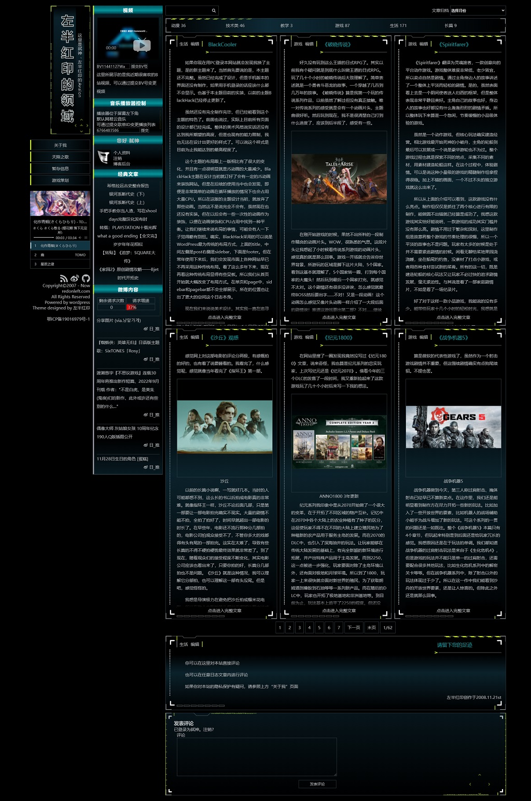

# BlackCooler
本代码库是一个基于WordPress的主题  
使用并适用于  
https://www.redonleft.com/  
可以直接点击查看  

因为是我私有网站使用，不能保证所有网站的适用性。可能会缺失很多功能或者产生兼容性问题，请在有一定技术能力的基础上自行使用。  
## 版权
主题基于GPL3.0协议，在协议允许的范围内使用请注明本主题的GitHub链接。  
如有商业使用的需求，请联系我。  
## 安装
需先行安装WordPress  
如果不会，请参照
### 下载  
英文  
https://wordpress.org/download/#download-install  
中文  
https://cn.wordpress.org/download/#download-install
### 安装  
英文  
https://wordpress.org/support/article/how-to-install-wordpress/  
中文  
https://cn.wordpress.org/support/article/how-to-install-wordpress/  
在安装并能成功运行WordPress后，进入下方文件夹并运行代码  
```
wordpress\wp-content\themes\ 
git clone https://github.com/alucardwind/BlackCooler.git
```
在使用中请尽量获取最新版本的代码  
相关git代码请自行学习  
  
进入WordPress后台，在外观-主题中启用BlackCooler  
  
本主题自动搭配以下插件，请自行下载使用  
请自行学习如何手动安装WordPress插件  
[redonleft_player](https://github.com/alucardwind/redonleft_player)  
[redonleft_copyright](https://github.com/alucardwind/redonleft_copyright)  
微博插件  
该插件的制作基于[微博PHP API](https://github.com/xiaosier/libweibo)  
使用时请确保已经向新浪微博申请成功相关权限，申请地址https://open.weibo.com/  
如没有权限或不想使用该功能，请编辑文件sidebar.php，查找24行并删除下方语句
```
get_weibo();
```
或者直接删除文件weibo.php  
如果已经拥有相关权限，请编辑文件weibo.php，查找45行并填入相关权限代码
```
$c = new SaeTClientV2( '权限代码1', '权限代码2', '权限代码3' );
```

